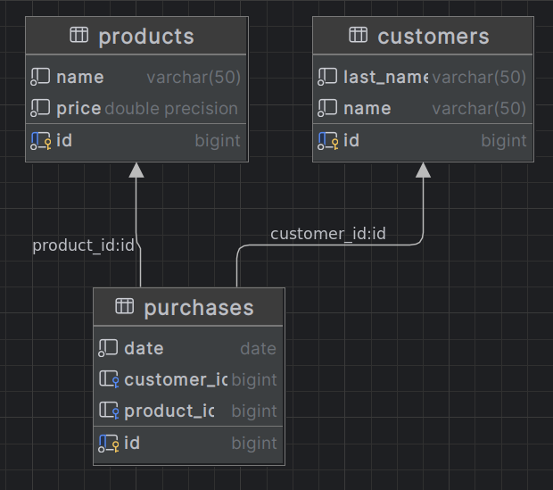
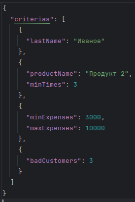
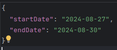

# SimpleDatabaseAnalyzer

## 1. Что такое SimpleDatabaseAnalyzer.
SimpleDatabaseAnalyzer приложение, 
которое при запуске на вход принимает тип операции, путь до входного файла с набором критериев, выходной файл с путём куда записать обработанную информацию проанализированную из базы данных.

### Аргументы запуска приложения.
- тип операции: search/stat
- путь до входного файла: "абсолютный путь/*.json"
- путь до выходного файла: "абсолютный путь/*.json"
- 
### База данных.
В приложении реализовано подключение к базе данных Postgres к дефолтной схеме public в дефолтной БД postgres имеющую следующую структуру.
- Покупатели - имя, фамилия
- Продукты - название, цена
- Покупки - дата покупки, покупатель, продукт 

### Тип операции.
В текущей версии приложения предусмотренно 2 типа операции:
- search - на вход должен подаваться файл с расширением .json, который содержит в себе набор критериев для анализа.
    Критерии:
    - Фамилия — поиск покупателей с этой фамилией.
    - Название товара и число раз — поиск покупателей, купивших этот товар не менее, чем
      указанное число раз.
    - Минимальная и максимальная стоимость всех покупок — поиск покупателей, у которых
      общая стоимость всех покупок за всё время попадает в интервал.
    - Число пассивных покупателей — поиск покупателей, купивших меньше всего товаров.
      Возвращается не более, чем указанное число покупателей.

    
    
    Важно отметить, что критерии могут повторяться, например, два раза критерий с lastName.
    Результат операции записывается в output.json по указанному пути при запуске приложения.

- stat - на вход должен подаваться файл с расширением .json, который содержит в себе диапозон дат для анализа и сбора статистики.
    
    

Результат операции - статистика по покупателям за период из двух дат, включительно, без выходных.

### Инструкция по запуску.
Перед запуском приложения, необходимо локально запустить сервер Postgres со стандартной реализацией дефолтной бд postgres с дефолтной схемой public.

user и password для подключения задаются в [application.properties](src%2Fmain%2Fresources%2Fapplication.properties).

Для создания таблиц в базе, выполните скрипты в [schema.sql](src%2Fmain%2Fresources%2Fschema.sql)
Для наполнения таблиц данными, выполните скрипты в [data.sql](src%2Fmain%2Fresources%2Fdata.sql)

Далее необходимо собрать исполняемый JAR. Для этого выполните команду mvn package в терминале из корня проекта.
Что бы запустить JAR, необходимо выполнить команду:

SimpleDatabaseAnalyzer$ java -jar target/SimpleDatabaseAnalyzer-0.0.1.jar [операция] [абсолютный путь до входного файла/*.json] [абсолютный путь до выходного/*.json]

Для удобства используйте тестовые входные файлы:
- операция search - [inputSearch.json](src%2Fmain%2Fresources%2Fexampleinput%2FinputSearch.json)
- операция stat - [inputStatistic.json](src%2Fmain%2Fresources%2Fexampleinput%2FinputStatistic.json)
